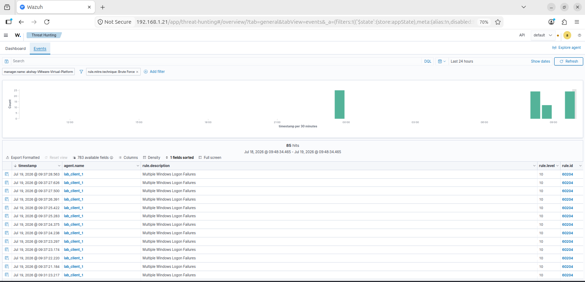
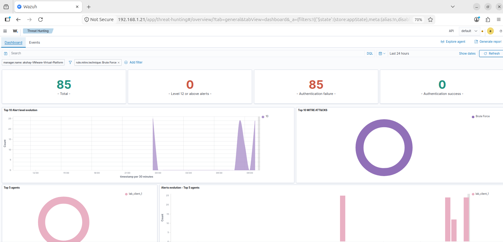
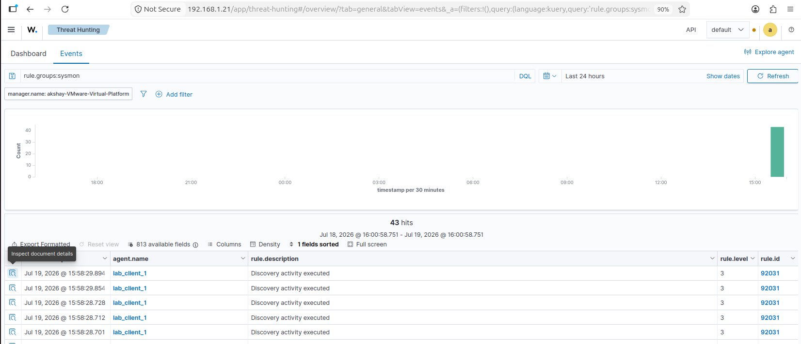
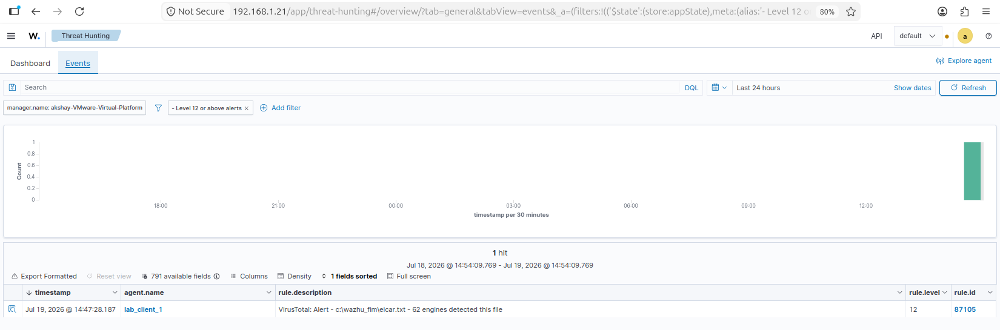
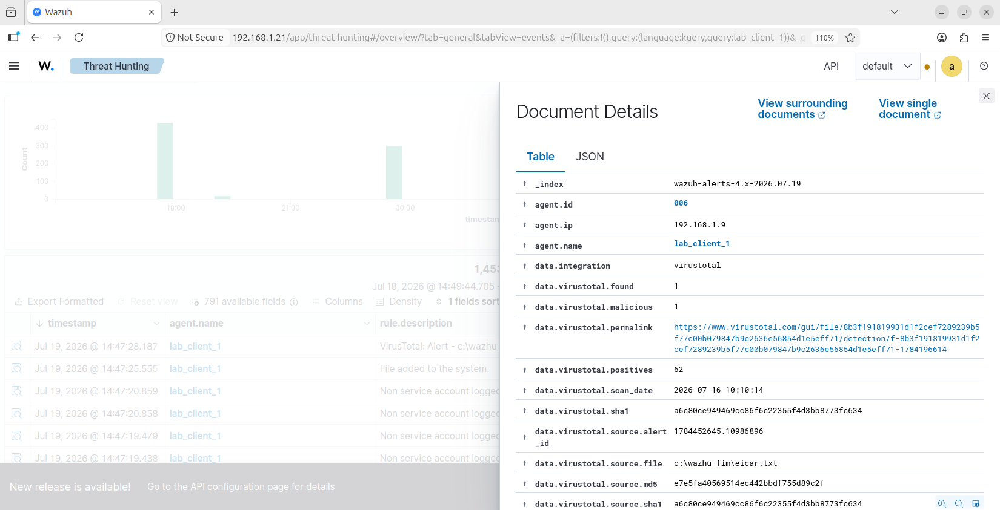
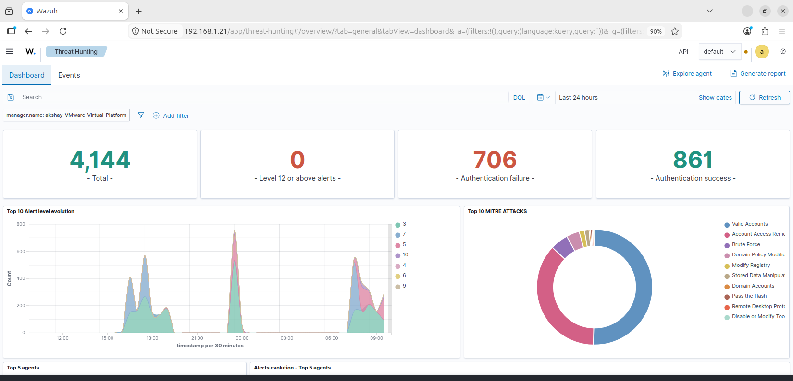

# Home SOC Lab

I built this over a weekend to get actual hands-on time with the stuff a SOC analyst does day to day — not just reading about SIEMs and detections, but standing one up myself, attacking it, and watching it catch things.

The setup: a Windows Server domain controller, a domain-joined Windows 10 client, and Wazuh as the SIEM, all running as VMs on the same network. Attacks came from a Parrot OS box on separate hardware.

## What's in here

- [Brute-force detection](#brute-force-detection)
- [Malware detection (FIM + VirusTotal)](#malware-detection)
- [Endpoint / process investigation with Sysmon](#endpoint-investigation)
- [Lab setup](#lab-setup)

---

## Brute-force detection

I ran Hydra from Parrot against the Windows client's RDP port, targeting a real domain account. It took 85 correlated failed-login attempts before Wazuh raised it as a level-10 alert — "Multiple Windows Logon Failures" — and Wazuh's own MITRE mapping tagged it as Brute Force automatically.

Filtering just on that MITRE tag, you can see the full run — 85 hits, all from the same source, clustered in a tight window. That clustering is really the whole signal: one failed login means nothing, a dozen in a few seconds means something's hammering the door.

Across the full 24-hour window the lab logged 706 failed logins and 861 successful ones — most of that is normal domain chatter, but the brute-force run sits clearly on top of it once you filter.

**Tools:** Wazuh, Hydra, Windows Server AD, RDP
**MITRE:** T1110 – Brute Force

---

## Malware detection

Wired up Wazuh's file integrity monitoring to VirusTotal, then dropped an EICAR test file (the standard, harmless string every AV recognizes as "this would be malware") into a watched folder to see the full pipeline work.

It got flagged almost immediately — 62 out of 70 engines on VirusTotal detected it, and Wazuh surfaced that straight into the alert as a level-12 event.

Digging into the alert details, Wazuh pulls back the actual VirusTotal report — hash, detection count, permalink to the full scan — so you're not just seeing "file changed," you're seeing a real threat-intel verdict.

**Tools:** Wazuh Syscheck (FIM), VirusTotal API, Windows Defender

---

## Endpoint investigation

Deployed Sysmon (SwiftOnSecurity config) on the client and wired its logs into Wazuh, then ran some basic discovery commands to see what Wazuh actually captures at the process level — not just "someone logged on," but what they ran once they were in.

`net user` showed up with the full command line, the parent process (`net.exe` spawning `net1.exe`, which is a genuinely real Windows quirk I didn't know about until I saw it in the logs), and the account it ran under.

**Tools:** Sysmon, Wazuh, Windows Event Log
**MITRE:** T1087 – Account Discovery

---

## Lab setup

- **Domain controller:** Windows Server 2019, AD DS + DNS, static IP
- **Client:** Windows 10 Pro, domain-joined
- **SIEM:** Wazuh (manager, indexer, dashboard) on Ubuntu, static IP
- **Attacker box:** Parrot OS, separate physical machine, same network

Everything's on static IPs on purpose — agents hardcode the manager's address, so a DHCP change quietly breaks every agent at once. Learned that one the hard way.

---

Still working through this — next up is a proper Active Directory attack (Kerberoasting) and a phishing analysis writeup. Will add both here once they're done.

**Akshay Sharma** · [LinkedIn](#) · akshaysharmaadept@gmail.com
